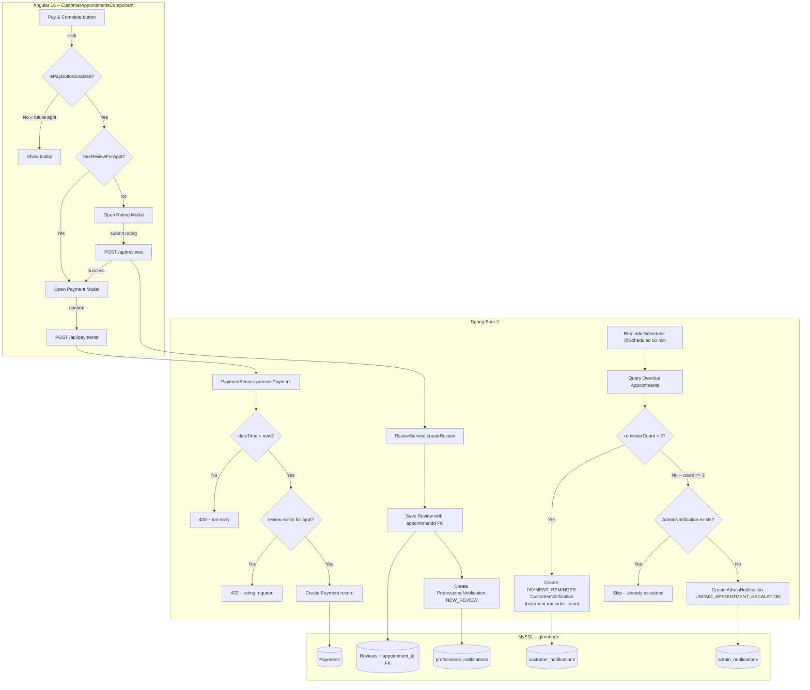

# Design Document: Payment & Rating Enforcement

## Overview

This feature enforces a strict lifecycle for GlamBook appointment completion:

1. **Timing gate** — the Pay button is disabled until the appointment time has arrived (frontend + backend).
2. **Rating gate** — the customer must submit a star rating before the payment modal opens (frontend + backend).
3. **Review notification** — submitting a review triggers a `NEW_REVIEW` `ProfessionalNotification`.
4. **Overdue reminders** — a scheduled job sends `PAYMENT_REMINDER` `CustomerNotification`s for unpaid confirmed appointments.
5. **Admin escalation** — after 3 unanswered reminders the scheduler creates an `AdminNotification`.

The changes touch the Angular 16 frontend (one component + one service), the Spring Boot 3 backend (two services, one new service, one scheduler, two controllers, three repositories), and the MySQL schema (one new column, one new table, two enum additions).

---

## Architecture



---

## Components and Interfaces

### Frontend

#### `CustomerAppointmentsComponent` (modified)

New state fields added to the existing component:

```typescript
// Timer handle for 60-second re-evaluation
private payTimerHandle: ReturnType<typeof setInterval> | null = null;

// Tracks which appointments already have a review (appointmentId → boolean)
reviewedAppointments: Map<number, boolean> = new Map();

// Appointment waiting for rating before payment proceeds
pendingPayAppt: AppointmentResponse | null = null;
```

New methods:

| Method | Purpose |
|---|---|
| `isPayButtonEnabled(appt)` | Returns `true` when `Date.now() >= new Date(appt.scheduledAt).getTime()` |
| `payButtonTooltip(appt)` | Returns `"Payment available from <formatted scheduledAt>"` when disabled |
| `openPayGuarded(appt)` | Checks review existence, routes to Rating Modal or Payment Modal |
| `onRatingSubmitted()` | Called after successful review POST; opens Payment Modal for `pendingPayAppt` |
| `checkReviewExists(apptId)` | Calls `GET /api/reviews/exists?appointmentId={id}` and caches result |
| `startPayTimer()` | Sets up 60-second `setInterval` to call `cdr.markForCheck()` |
| `ngOnDestroy()` | Clears the interval |

#### New API endpoint consumed by frontend

`GET /api/reviews/exists?appointmentId={id}` — returns `{ exists: boolean }`.

---

### Backend

#### `PaymentService` (modified)

Two new validation steps inserted before the existing duplicate-payment check:

```
1. Timing check  → throw ValidationException("Payment is not allowed before the appointment time") if appointment.dateTime > now
2. Rating check  → throw ValidationException("A rating must be submitted before payment can be processed") if no Review exists for (customerId, appointmentId)
```

The `customerId` is resolved from the JWT principal inside `PaymentController` and passed to `PaymentService.processPayment(request, customerId)`.

#### `ReviewService` (modified)

After saving the `Review`:

1. Duplicate check: `reviewRepository.existsByCustomerIdAndAppointmentId(customerId, appointmentId)` → throw `DuplicateReviewException` (HTTP 409) if true.
2. Persist `Review` with `appointment` FK set.
3. Build and save `ProfessionalNotification`:
   - `type = NEW_REVIEW`
   - `referenceId = review.id`
   - `message = "{customerName} rated you {rating}/5: {comment.substring(0,100)}"`

#### `ReminderScheduler` (new)

```java
@Component
public class ReminderScheduler {
    @Scheduled(fixedRate = 3_600_000) // every 60 minutes
    public void processOverdueAppointments() { ... }
}
```

Logic per overdue appointment:

```
overdueAppointments = appointmentRepository.findOverdueUnpaid(now)

for each appt:
    if appt.reminderCount < 3:
        if lastReminderSentAt == null OR lastReminderSentAt < now - 24h:
            create CustomerNotification(PAYMENT_REMINDER)
            appt.reminderCount++
            appt.lastReminderSentAt = now
    else if appt.reminderCount == 3:
        if NOT adminNotificationRepository.existsByReferenceId(appt.id):
            create AdminNotification(UNPAID_APPOINTMENT_ESCALATION)
```

#### `AdminNotificationController` (new)

```
GET /api/admin/notifications  →  returns List<AdminNotificationResponse> ordered by createdAt DESC
PATCH /api/admin/notifications/{id}/read  →  marks as read
```

#### `ReviewController` (modified)

New endpoint:

```
GET /api/reviews/exists?appointmentId={id}  →  { "exists": true/false }
```

---

## Data Models

### Entity Changes

#### `Review` — add `appointment` FK

```java
@ManyToOne(fetch = FetchType.LAZY)
@JoinColumn(name = "appointment_id")
private Appointment appointment;
```

#### `Appointment` — add reminder tracking columns

```java
@Column(name = "reminder_count")
@Builder.Default
private int reminderCount = 0;

@Column(name = "last_reminder_sent_at")
private LocalDateTime lastReminderSentAt;
```

#### `AdminNotification` (new entity)

```java
@Entity
@Table(name = "admin_notifications")
public class AdminNotification {
    @Id @GeneratedValue(strategy = GenerationType.IDENTITY)
    private Long id;

    @Column(nullable = false, columnDefinition = "TEXT")
    private String message;

    @Column(name = "reference_id")   // appointmentId
    private Long referenceId;

    @Column(name = "is_read")
    @Builder.Default
    private boolean isRead = false;

    @CreationTimestamp
    @Column(name = "created_at", updatable = false)
    private LocalDateTime createdAt;
}
```

### Enum Changes

#### `CustomerNotificationType`

```java
BOOKING_CONFIRMED, BOOKING_CANCELLED, PAYMENT_SUCCESS, PAYMENT_REFUNDED,
REVIEW_RESPONSE, COMMUNICATION_RECEIVED, LOYALTY_POINTS_EARNED,
POLICY_UPDATED, PROMOTION_AVAILABLE, CONSULTATION_CONFIRMED,
PAYMENT_REMINDER   // ← new
```

#### `NotificationType` (used for AdminNotification)

```java
NEW_BOOKING, COMPLAINT_FORWARDED, PROFESSIONAL_PENDING, APPOINTMENT_CANCELLED,
UNPAID_APPOINTMENT_ESCALATION   // ← new
```

### New Repository Methods

| Repository | New Method |
|---|---|
| `ReviewRepository` | `boolean existsByCustomerIdAndAppointmentId(Long customerId, Long appointmentId)` |
| `ReviewRepository` | `boolean existsByAppointmentId(Long appointmentId)` |
| `AppointmentRepository` | `List<Appointment> findOverdueUnpaid(LocalDateTime now)` (JPQL) |
| `CustomerNotificationRepository` | `long countByCustomerIdAndReferenceIdAndType(Long customerId, Long referenceId, CustomerNotificationType type)` |
| `AdminNotificationRepository` | `boolean existsByReferenceId(Long referenceId)` (new repository) |

### SQL Migration (alter.sql additions)

```sql
-- Reviews: appointment FK
ALTER TABLE Reviews ADD COLUMN appointment_id BIGINT NULL;
ALTER TABLE Reviews ADD CONSTRAINT fk_review_appointment
    FOREIGN KEY (appointment_id) REFERENCES Appointments(id) ON DELETE SET NULL;

-- Appointments: reminder tracking
ALTER TABLE Appointments ADD COLUMN reminder_count INT NOT NULL DEFAULT 0;
ALTER TABLE Appointments ADD COLUMN last_reminder_sent_at DATETIME NULL;

-- Admin notifications table
CREATE TABLE admin_notifications (
    id              BIGINT AUTO_INCREMENT PRIMARY KEY,
    message         TEXT NOT NULL,
    reference_id    BIGINT NULL,
    is_read         BOOLEAN NOT NULL DEFAULT FALSE,
    created_at      DATETIME NOT NULL DEFAULT CURRENT_TIMESTAMP
);
```

---

## Correctness Properties

*A property is a characteristic or behavior that should hold true across all valid executions of a system — essentially, a formal statement about what the system should do. Properties serve as the bridge between human-readable specifications and machine-verifiable correctness guarantees.*

### Property 1: Pay button disabled for future appointments

*For any* appointment whose `scheduledAt` is strictly in the future relative to the current time, `isPayButtonEnabled(appointment)` SHALL return `false`.

**Validates: Requirements 1.1**

---

### Property 2: Pay button enabled for past/present appointments

*For any* appointment whose `scheduledAt` is in the past or equal to the current time, `isPayButtonEnabled(appointment)` SHALL return `true`.

**Validates: Requirements 1.2**

---

### Property 3: Tooltip message contains scheduled time

*For any* appointment with a future `scheduledAt`, `payButtonTooltip(appointment)` SHALL return a string that contains the formatted representation of `scheduledAt`.

**Validates: Requirements 1.4**

---

### Property 4: Backend rejects payment for future appointments

*For any* appointment whose `dateTime` is strictly after the server's current time, calling `PaymentService.processPayment` SHALL throw a `ValidationException` with the message `"Payment is not allowed before the appointment time"`.

**Validates: Requirements 2.1**

---

### Property 5: Backend accepts payment for past/present appointments (timing check only)

*For any* appointment whose `dateTime` is in the past or equal to the server's current time, the timing check in `PaymentService.processPayment` SHALL pass without throwing a timing-related exception.

**Validates: Requirements 2.2**

---

### Property 6: Payment guard routes to rating modal when no review exists

*For any* confirmed appointment for which no review exists (as reported by `GET /api/reviews/exists`), clicking the Pay button SHALL open the Rating Modal and NOT open the Payment Modal.

**Validates: Requirements 3.1, 3.2**

---

### Property 7: Valid rating enables payment flow

*For any* integer rating `r` in the range `[1, 5]`, submitting the Rating Modal with that rating SHALL close the Rating Modal and open the Payment Modal.

**Validates: Requirements 3.3, 3.5**

---

### Property 8: Comment length validation

*For any* comment string `c`, `isCommentValid(c)` SHALL return `true` if and only if `c.length <= 1000`.

**Validates: Requirements 3.6**

---

### Property 9: Backend rejects payment when no review exists for appointment

*For any* appointment for which no `Review` record exists linking the authenticated customer to that appointment, calling `PaymentService.processPayment` SHALL throw a `ValidationException` with the message `"A rating must be submitted before payment can be processed"`.

**Validates: Requirements 4.1, 4.2**

---

### Property 10: Review creation triggers NEW_REVIEW notification

*For any* valid review (any customer, any professional, any rating in `[1,5]`, any comment), after `ReviewService.createReview` completes, a `ProfessionalNotification` of type `NEW_REVIEW` SHALL exist for the reviewed professional with `referenceId` equal to the new review's ID.

**Validates: Requirements 5.1, 5.3**

---

### Property 11: Review notification message contains required fields

*For any* review with customer name `n`, rating `r`, and comment `c`, the generated `ProfessionalNotification` message SHALL contain `n`, the string representation of `r`, and the first `min(100, c.length)` characters of `c`.

**Validates: Requirements 5.2**

---

### Property 12: Notifications are ordered by createdAt descending

*For any* list of notifications returned by `GET /api/professional/notifications` or `GET /api/admin/notifications`, every consecutive pair `(n[i], n[i+1])` SHALL satisfy `n[i].createdAt >= n[i+1].createdAt`.

**Validates: Requirements 5.4, 7.5**

---

### Property 13: Review persisted with appointment FK

*For any* valid `appointmentId`, after `ReviewService.createReview` with that `appointmentId`, the saved `Review` SHALL have `review.appointment.id == appointmentId`.

**Validates: Requirements 8.2**

---

### Property 14: Duplicate review per appointment is rejected

*For any* customer and appointment for which a `Review` already exists, a second call to `ReviewService.createReview` with the same `(customerId, appointmentId)` SHALL throw a `DuplicateReviewException` (HTTP 409).

**Validates: Requirements 8.3**

---

### Property 15: Overdue appointment with fewer than 3 reminders receives a PAYMENT_REMINDER

*For any* appointment with status `CONFIRMED`, `dateTime` in the past, no `PAID` payment, and `reminderCount < 3`, one execution of `ReminderScheduler.processOverdueAppointments` SHALL create exactly one `CustomerNotification` of type `PAYMENT_REMINDER` for that customer, and SHALL increment `reminderCount` by 1.

**Validates: Requirements 6.2**

---

### Property 16: Reminder message contains required appointment fields

*For any* overdue appointment, the generated `PAYMENT_REMINDER` message SHALL contain the service name, professional name, and the appointment `dateTime`.

**Validates: Requirements 6.3, 6.4**

---

### Property 17: No duplicate reminder within 24-hour window

*For any* appointment that already has a `lastReminderSentAt` within the last 24 hours, running `ReminderScheduler.processOverdueAppointments` SHALL NOT create a new `PAYMENT_REMINDER` notification for that appointment.

**Validates: Requirements 6.6**

---

### Property 18: Escalation fires exactly once per appointment

*For any* overdue appointment with `reminderCount == 3` and no existing `AdminNotification` for that appointment, one scheduler run SHALL create exactly one `AdminNotification`. Subsequent scheduler runs for the same appointment SHALL NOT create additional `AdminNotification` records.

**Validates: Requirements 7.1, 7.3**

---

### Property 19: Escalation message contains required fields

*For any* escalation, the `AdminNotification` message SHALL contain the customer's name, customer ID, service name, professional name, and appointment `dateTime`.

**Validates: Requirements 7.2**

---

## Error Handling

| Scenario | Layer | HTTP Status | Message |
|---|---|---|---|
| Payment before appointment time | Backend `PaymentService` | 400 | `"Payment is not allowed before the appointment time"` |
| Payment without prior rating | Backend `PaymentService` | 422 | `"A rating must be submitted before payment can be processed"` |
| Appointment not found | Backend `PaymentService` | 404 | `"Appointment not found"` |
| Appointment belongs to different customer | Backend `PaymentController` | 403 | `"Access denied"` |
| Duplicate review for same appointment | Backend `ReviewService` | 409 | `"A review for this appointment already exists"` |
| Rating out of range (1–5) | Frontend + Backend `@Min`/`@Max` | 400 | `"Please provide a valid rating"` |
| Comment exceeds 1000 chars | Frontend (maxlength) + Backend `@Size` | 400 | `"Comment must not exceed 1000 characters"` |
| Scheduler query failure | Backend `ReminderScheduler` | — | Logged as ERROR; scheduler continues to next appointment |
| Admin notification already exists | Backend `ReminderScheduler` | — | Silently skipped (idempotent guard) |

All backend exceptions are handled by the existing `GlobalExceptionHandler` (`@ControllerAdvice`). New exception type `DuplicateReviewException` (HTTP 409) will be added and registered there.

---

## Testing Strategy

### Unit Tests (example-based)

- `PaymentServiceTest`: happy path (past appointment + review exists), timing rejection, rating rejection, appointment-not-found, wrong customer.
- `ReviewServiceTest`: happy path with notification creation, duplicate rejection, appointmentId FK persisted.
- `ReminderSchedulerTest`: reminder created for count=0, reminder skipped within 24h window, escalation created at count=3, escalation not duplicated.
- `CustomerAppointmentsComponent` (Angular): `openPayGuarded` routes correctly when review exists vs. not; `closeReview` does not open payment modal.

### Property-Based Tests

**Backend** — jqwik 1.7.4:

Each property test runs a minimum of 100 iterations.

- **Feature: payment-rating-enforcement, Property 4**: Generate arbitrary `LocalDateTime` values in the future; assert `processPayment` throws `ValidationException`.
- **Feature: payment-rating-enforcement, Property 5**: Generate arbitrary past `LocalDateTime` values; assert timing check passes.
- **Feature: payment-rating-enforcement, Property 9**: Generate arbitrary appointments with no linked review; assert `processPayment` throws `ValidationException`.
- **Feature: payment-rating-enforcement, Property 10**: Generate arbitrary `(customer, professional, rating[1-5], comment)`; assert `ProfessionalNotification` of type `NEW_REVIEW` is created with correct `referenceId`.
- **Feature: payment-rating-enforcement, Property 11**: Generate arbitrary customer names, ratings, and comments; assert notification message contains all required substrings.
- **Feature: payment-rating-enforcement, Property 13**: Generate arbitrary valid appointments; assert saved review has correct `appointment.id`.
- **Feature: payment-rating-enforcement, Property 14**: Generate arbitrary `(customerId, appointmentId)` pairs; assert second `createReview` call throws `DuplicateReviewException`.
- **Feature: payment-rating-enforcement, Property 15**: Generate arbitrary overdue appointments with `reminderCount` in `[0,2]`; assert exactly one `PAYMENT_REMINDER` is created and `reminderCount` increments.
- **Feature: payment-rating-enforcement, Property 16**: Generate arbitrary overdue appointments; assert reminder message contains service name, professional name, and dateTime.
- **Feature: payment-rating-enforcement, Property 17**: Generate arbitrary appointments with `lastReminderSentAt` within the last 24 hours; assert no new reminder is created.
- **Feature: payment-rating-enforcement, Property 18**: Generate arbitrary overdue appointments with `reminderCount == 3`; assert exactly one `AdminNotification` is created across multiple scheduler runs.
- **Feature: payment-rating-enforcement, Property 19**: Generate arbitrary escalation scenarios; assert `AdminNotification` message contains all required fields.

**Frontend** — fast-check 3.12:

- **Feature: payment-rating-enforcement, Property 1 & 2**: Generate arbitrary `Date` values; assert `isPayButtonEnabled` returns correct boolean based on comparison with `scheduledAt`.
- **Feature: payment-rating-enforcement, Property 3**: Generate arbitrary future `Date` values; assert tooltip string contains the formatted date.
- **Feature: payment-rating-enforcement, Property 7**: Generate arbitrary integers in `[1,5]`; assert rating modal submit triggers payment modal open.
- **Feature: payment-rating-enforcement, Property 8**: Generate arbitrary strings; assert `isCommentValid` returns `true` iff `length <= 1000`.
- **Feature: payment-rating-enforcement, Property 12**: Generate arbitrary notification arrays; assert ordering invariant holds after sort.

### Integration Tests

- End-to-end flow: create appointment → submit review → process payment (all three checks pass).
- Scheduler integration: seed overdue appointments in H2, run scheduler, assert notifications created.
- Admin notification endpoint: seed `AdminNotification` records, call `GET /api/admin/notifications`, assert ordering and response shape.
