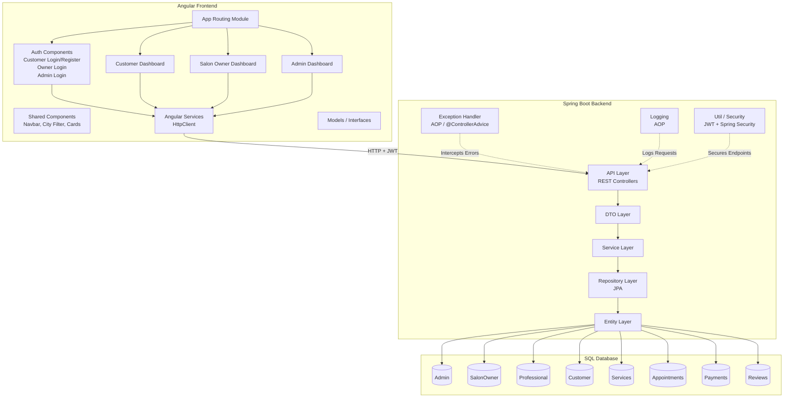
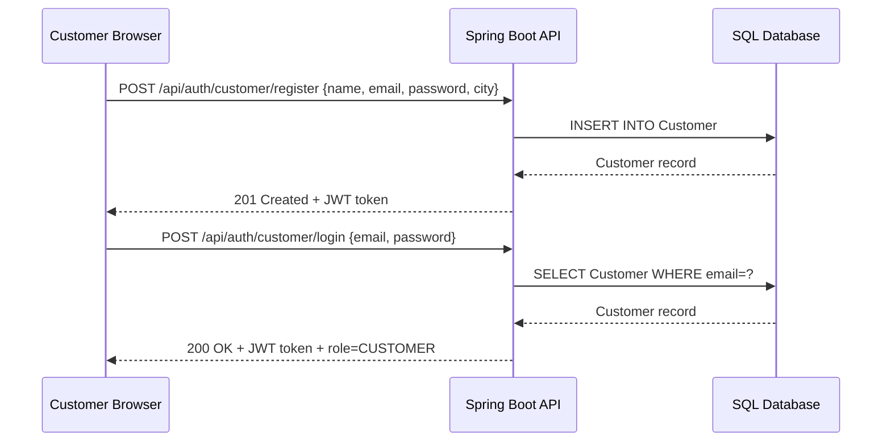
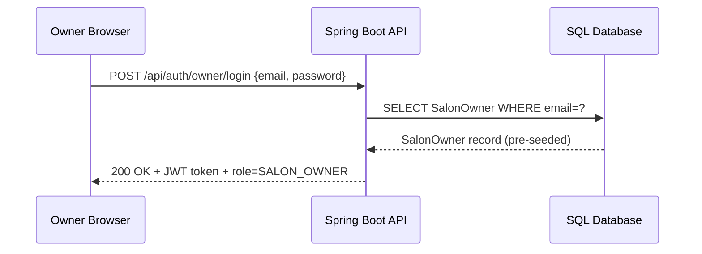
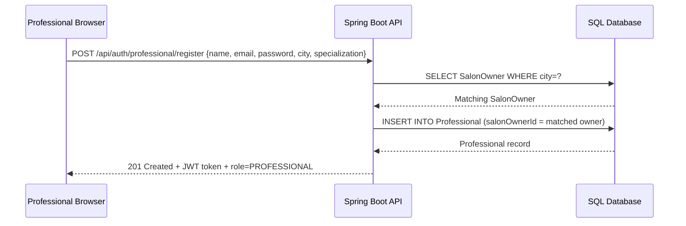
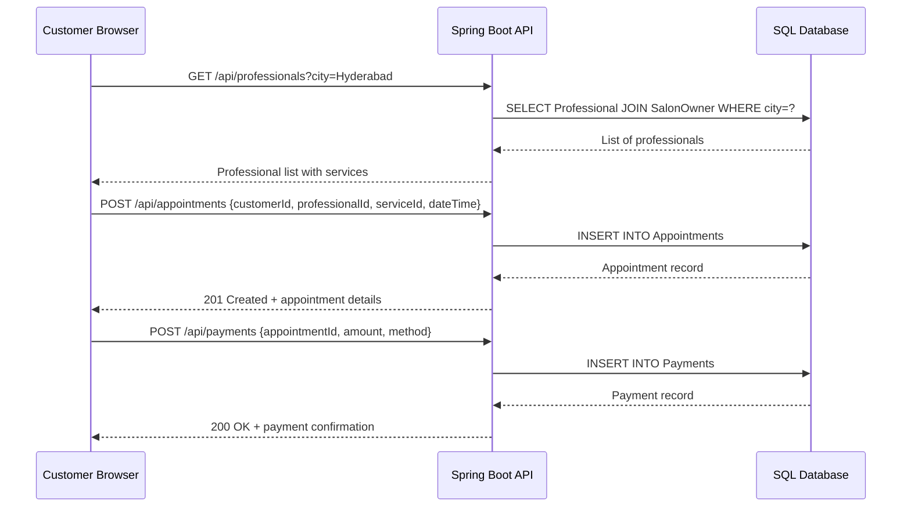
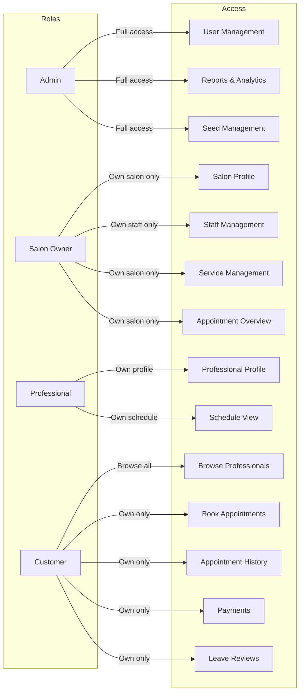

# Design Document: Salon Management Web Application

## Overview

A full-stack salon management platform built with Angular (frontend) and Spring Boot (backend), enabling customers to discover and book salon professionals by city, while giving salon owners and admins dedicated dashboards to manage staff, services, and appointments. The system enforces role-based access for four actor types — Admin, Salon Owner, Professional, and Customer — each with a tailored experience and distinct authentication flow.

The application is designed to be modular and scalable, supporting future extensions such as ratings, promotions, and notifications. The tech stack uses Angular with Bootstrap for a clean, responsive UI themed around `#244AFD` (primary) and white (secondary), backed by a Spring Boot REST API and a relational SQL database.

## Architecture



## Sequence Diagrams

### Customer Registration & Login



### Salon Owner Login (No Registration)



### Professional Registration



### Customer Books Appointment



## Components and Interfaces

### Frontend Components

#### Auth Module

**Customer Auth** (`/auth/customer`)
- `CustomerLoginComponent` — email/password form, redirects to customer dashboard
- `CustomerRegisterComponent` — name, email, password, city dropdown

**Salon Owner Auth** (`/auth/owner`)
- `OwnerLoginComponent` — separate login page, no registration link

**Admin Auth** (`/auth/admin`)
- `AdminLoginComponent` — fixed credentials login, separate button on landing page

**Professional Auth** (`/auth/professional`)
- `ProfessionalRegisterComponent` — name, email, password, city dropdown (auto-assigns to owner)

#### Dashboard Modules

**Customer Dashboard** (`/dashboard/customer`)
- `ProfessionalBrowseComponent` — card grid with city filter dropdown
- `AppointmentBookingComponent` — date/time picker, service selector
- `AppointmentHistoryComponent` — list of past/upcoming appointments
- `CustomerProfileComponent` — view/edit profile

**Salon Owner Dashboard** (`/dashboard/owner`)
- `OwnerProfileComponent` — salon info, city, contact
- `StaffListComponent` — list of assigned professionals
- `ServiceManagementComponent` — view/add/edit services offered
- `AppointmentOverviewComponent` — all appointments for the salon

**Admin Dashboard** (`/dashboard/admin`)
- `UserManagementComponent` — view all customers, owners, professionals
- `SalonOwnerListComponent` — manage pre-seeded owners
- `ReportsComponent` — appointments, payments summary

#### Shared Components

- `NavbarComponent` — role-aware navigation bar (theme: `#244AFD`)
- `CityFilterComponent` — reusable dropdown for city selection
- `ProfessionalCardComponent` — card showing professional info, services, rating
- `LoadingSpinnerComponent` — global loading indicator
- `AlertComponent` — success/error toast notifications

#### Angular Services

```typescript
interface AuthService {
  loginCustomer(credentials: LoginRequest): Observable<AuthResponse>
  loginOwner(credentials: LoginRequest): Observable<AuthResponse>
  loginAdmin(credentials: LoginRequest): Observable<AuthResponse>
  registerCustomer(data: CustomerRegisterRequest): Observable<AuthResponse>
  registerProfessional(data: ProfessionalRegisterRequest): Observable<AuthResponse>
  logout(): void
  getRole(): Role
  getToken(): string
}

interface ProfessionalService {
  getByCity(city: string): Observable<Professional[]>
  getById(id: number): Observable<Professional>
  getServices(professionalId: number): Observable<Service[]>
}

interface AppointmentService {
  book(request: AppointmentRequest): Observable<Appointment>
  getByCustomer(customerId: number): Observable<Appointment[]>
  getBySalon(salonOwnerId: number): Observable<Appointment[]>
  cancel(appointmentId: number): Observable<void>
}

interface PaymentService {
  process(request: PaymentRequest): Observable<Payment>
  getByAppointment(appointmentId: number): Observable<Payment>
}
```

### Backend Components

#### REST Controllers (`api` package)

```typescript
// Endpoint groups
AuthController        → /api/auth/**
CustomerController    → /api/customers/**
ProfessionalController → /api/professionals/**
OwnerController       → /api/owners/**
AdminController       → /api/admin/**
AppointmentController → /api/appointments/**
ServiceController     → /api/services/**
PaymentController     → /api/payments/**
ReviewController      → /api/reviews/**
```

#### Service Layer (`service` package)

```typescript
interface AuthService {
  authenticateCustomer(req: LoginRequest): AuthResponse
  authenticateOwner(req: LoginRequest): AuthResponse
  authenticateAdmin(req: LoginRequest): AuthResponse
  registerCustomer(req: CustomerRegisterRequest): AuthResponse
  registerProfessional(req: ProfessionalRegisterRequest): AuthResponse
  assignProfessionalToOwner(professional: Professional): SalonOwner
}

interface AppointmentService {
  createAppointment(req: AppointmentRequest): Appointment
  cancelAppointment(id: Long): void
  getAppointmentsByCustomer(customerId: Long): List<Appointment>
  getAppointmentsBySalon(salonOwnerId: Long): List<Appointment>
}
```

## Data Models

### Frontend Interfaces (`model` folder)

```typescript
type Role = 'ADMIN' | 'SALON_OWNER' | 'PROFESSIONAL' | 'CUSTOMER'

type City = 'Visakhapatnam' | 'Vijayawada' | 'Hyderabad' | 'Ananthapur' | 'Khammam'

interface AuthResponse {
  token: string
  role: Role
  userId: number
  name: string
}

interface Customer {
  id: number
  name: string
  email: string
  phone: string
  city: City
  profilePicture?: string
}

interface SalonOwner {
  id: number
  name: string
  salonName: string
  city: City
  email: string
  phone: string
}

interface Professional {
  id: number
  name: string
  email: string
  city: City
  specialization: string
  salonOwner: SalonOwner
  services: Service[]
  rating?: number
}

interface Service {
  id: number
  name: string
  category: ServiceCategory
  gender: 'MEN' | 'WOMEN' | 'KIDS'
  price: number
  durationMinutes: number
}

interface Appointment {
  id: number
  customer: Customer
  professional: Professional
  service: Service
  dateTime: string   // ISO 8601
  status: 'PENDING' | 'CONFIRMED' | 'COMPLETED' | 'CANCELLED'
  payment?: Payment
}

interface Payment {
  id: number
  appointmentId: number
  amount: number
  method: 'CASH' | 'CARD' | 'UPI'
  status: 'PENDING' | 'PAID' | 'REFUNDED'
  paidAt?: string
}

interface Review {
  id: number
  customerId: number
  professionalId: number
  rating: number       // 1–5
  comment: string
  createdAt: string
}
```

### Database Schema

```sql
-- Admin (fixed credentials, no registration)
CREATE TABLE Admin (
    id          BIGINT PRIMARY KEY AUTO_INCREMENT,
    username    VARCHAR(50) UNIQUE NOT NULL,
    password    VARCHAR(255) NOT NULL  -- BCrypt hashed
);

-- Salon Owners (pre-seeded, one per city)
CREATE TABLE SalonOwner (
    id          BIGINT PRIMARY KEY AUTO_INCREMENT,
    name        VARCHAR(100) NOT NULL,
    salon_name  VARCHAR(150) NOT NULL,
    city        VARCHAR(50) NOT NULL,
    email       VARCHAR(100) UNIQUE NOT NULL,
    password    VARCHAR(255) NOT NULL,
    phone       VARCHAR(20)
);

-- Professionals (register with city → auto-assigned to owner)
CREATE TABLE Professional (
    id              BIGINT PRIMARY KEY AUTO_INCREMENT,
    name            VARCHAR(100) NOT NULL,
    email           VARCHAR(100) UNIQUE NOT NULL,
    password        VARCHAR(255) NOT NULL,
    city            VARCHAR(50) NOT NULL,
    specialization  VARCHAR(100),
    salon_owner_id  BIGINT NOT NULL,
    FOREIGN KEY (salon_owner_id) REFERENCES SalonOwner(id)
);

-- Customers
CREATE TABLE Customer (
    id              BIGINT PRIMARY KEY AUTO_INCREMENT,
    name            VARCHAR(100) NOT NULL,
    email           VARCHAR(100) UNIQUE NOT NULL,
    password        VARCHAR(255) NOT NULL,
    phone           VARCHAR(20),
    city            VARCHAR(50),
    profile_picture VARCHAR(255)
);

-- Services hierarchy (seeded)
CREATE TABLE Services (
    id              BIGINT PRIMARY KEY AUTO_INCREMENT,
    name            VARCHAR(100) NOT NULL,
    category        VARCHAR(50) NOT NULL,  -- Hair, Beard, Skin, etc.
    gender          ENUM('MEN','WOMEN','KIDS') NOT NULL,
    price           DECIMAL(10,2) NOT NULL,
    duration_mins   INT NOT NULL
);

-- Appointments
CREATE TABLE Appointments (
    id              BIGINT PRIMARY KEY AUTO_INCREMENT,
    customer_id     BIGINT NOT NULL,
    professional_id BIGINT NOT NULL,
    service_id      BIGINT NOT NULL,
    date_time       DATETIME NOT NULL,
    status          ENUM('PENDING','CONFIRMED','COMPLETED','CANCELLED') DEFAULT 'PENDING',
    FOREIGN KEY (customer_id)     REFERENCES Customer(id),
    FOREIGN KEY (professional_id) REFERENCES Professional(id),
    FOREIGN KEY (service_id)      REFERENCES Services(id)
);

-- Payments
CREATE TABLE Payments (
    id              BIGINT PRIMARY KEY AUTO_INCREMENT,
    appointment_id  BIGINT UNIQUE NOT NULL,
    amount          DECIMAL(10,2) NOT NULL,
    method          ENUM('CASH','CARD','UPI') NOT NULL,
    status          ENUM('PENDING','PAID','REFUNDED') DEFAULT 'PENDING',
    paid_at         DATETIME,
    FOREIGN KEY (appointment_id) REFERENCES Appointments(id)
);

-- Reviews
CREATE TABLE Reviews (
    id              BIGINT PRIMARY KEY AUTO_INCREMENT,
    customer_id     BIGINT NOT NULL,
    professional_id BIGINT NOT NULL,
    rating          TINYINT NOT NULL CHECK (rating BETWEEN 1 AND 5),
    comment         TEXT,
    created_at      DATETIME DEFAULT CURRENT_TIMESTAMP,
    FOREIGN KEY (customer_id)     REFERENCES Customer(id),
    FOREIGN KEY (professional_id) REFERENCES Professional(id)
);
```

### Seed Data

```sql
-- Seed: 5 Salon Owners (one per city)
INSERT INTO SalonOwner (name, salon_name, city, email, password, phone) VALUES
('Ravi Kumar',   'Ravi Salon',   'Visakhapatnam', 'ravi@salon.com',   '$2a$10$...', '9000000001'),
('Priya Reddy',  'Priya Salon',  'Vijayawada',    'priya@salon.com',  '$2a$10$...', '9000000002'),
('Suresh Rao',   'Suresh Salon', 'Hyderabad',     'suresh@salon.com', '$2a$10$...', '9000000003'),
('Anita Sharma', 'Anita Salon',  'Ananthapur',    'anita@salon.com',  '$2a$10$...', '9000000004'),
('Kiran Babu',   'Kiran Salon',  'Khammam',       'kiran@salon.com',  '$2a$10$...', '9000000005');

-- Seed: Services (Men)
INSERT INTO Services (name, category, gender, price, duration_mins) VALUES
('Haircut',        'Hair',     'MEN', 150.00, 30),
('Hair Color',     'Hair',     'MEN', 500.00, 60),
('Beard Trim',     'Beard',    'MEN', 100.00, 20),
('Beard Style',    'Beard',    'MEN', 200.00, 30),
('Face Cleanup',   'Skin',     'MEN', 300.00, 45),
('Men Package',    'Packages', 'MEN', 700.00, 90);

-- Seed: Services (Women)
INSERT INTO Services (name, category, gender, price, duration_mins) VALUES
('Haircut',        'Hair',   'WOMEN', 250.00, 45),
('Hair Color',     'Hair',   'WOMEN', 800.00, 90),
('Facial',         'Skin',   'WOMEN', 500.00, 60),
('Manicure',       'Nails',  'WOMEN', 300.00, 45),
('Pedicure',       'Nails',  'WOMEN', 350.00, 45),
('Bridal Makeup',  'Makeup', 'WOMEN', 3000.00, 120),
('Body Massage',   'Body',   'WOMEN', 1000.00, 60);

-- Seed: Services (Kids)
INSERT INTO Services (name, category, gender, price, duration_mins) VALUES
('Kids Haircut',   'Hair',     'KIDS', 100.00, 20),
('Kids Grooming',  'Grooming', 'KIDS', 150.00, 30),
('Special Styling','Special',  'KIDS', 200.00, 30);
```

## Role-Based Access Control



### JWT Token Claims

```typescript
interface JwtPayload {
  sub: string        // user email
  role: Role         // ADMIN | SALON_OWNER | PROFESSIONAL | CUSTOMER
  userId: number
  city?: City        // for PROFESSIONAL and CUSTOMER
  iat: number
  exp: number
}
```

### Spring Security Route Guards

| Route Pattern | Allowed Roles |
|---|---|
| `/api/auth/**` | PUBLIC |
| `/api/professionals` (GET) | PUBLIC |
| `/api/services` (GET) | PUBLIC |
| `/api/customers/**` | CUSTOMER |
| `/api/appointments/**` | CUSTOMER, SALON_OWNER, PROFESSIONAL |
| `/api/payments/**` | CUSTOMER |
| `/api/reviews/**` | CUSTOMER |
| `/api/owners/**` | SALON_OWNER |
| `/api/admin/**` | ADMIN |

## Error Handling

### Error Scenarios

**Authentication Errors**
- Condition: Invalid credentials or expired JWT
- Response: `401 Unauthorized` with `{ error: "Invalid credentials" }`
- Recovery: Redirect to appropriate login page, clear local token

**Authorization Errors**
- Condition: Role does not have access to the requested resource
- Response: `403 Forbidden` with `{ error: "Access denied" }`
- Recovery: Show alert, redirect to role's dashboard

**City Mismatch on Professional Registration**
- Condition: No salon owner found for the selected city
- Response: `400 Bad Request` with `{ error: "No salon available in selected city" }`
- Recovery: Show inline form error, prompt user to select a different city

**Appointment Conflict**
- Condition: Professional already booked at requested date/time
- Response: `409 Conflict` with `{ error: "Time slot unavailable" }`
- Recovery: Show available slots, prompt re-selection

**Resource Not Found**
- Condition: Entity ID does not exist in DB
- Response: `404 Not Found` with `{ error: "Resource not found" }`
- Recovery: Show error page or toast notification

### Global Exception Handler (AOP)

```java
@ControllerAdvice
public class GlobalExceptionHandler {
    // Handles ResourceNotFoundException → 404
    // Handles AccessDeniedException     → 403
    // Handles ValidationException       → 400
    // Handles ConflictException         → 409
    // Handles all others                → 500
}
```

## Testing Strategy

### Unit Testing

- **Backend**: JUnit 5 + Mockito for service layer; test each service method in isolation
- **Frontend**: Jasmine + Karma for Angular components and services; mock HttpClient calls

### Property-Based Testing

**Property Test Library**: fast-check (frontend), jqwik (backend)

Key properties to verify:
- A professional registered with city X is always assigned to the salon owner of city X
- A JWT token decoded always contains the same role used during login
- Appointment status transitions are always valid (PENDING → CONFIRMED → COMPLETED, never backwards)
- Payment amount always equals the price of the booked service

### Integration Testing

- **Backend**: Spring Boot Test with H2 in-memory DB; test full request/response cycle for each controller
- **Frontend**: Angular TestBed integration tests for component + service interaction
- **E2E**: Cypress for critical user journeys (customer registration → browse → book → pay)

## Performance Considerations

- City-based filtering uses an indexed `city` column on `Professional` and `Customer` tables
- JWT stateless authentication avoids server-side session storage
- Angular lazy loading per dashboard module reduces initial bundle size
- Pagination on professional browse endpoint (`/api/professionals?city=X&page=0&size=10`)

## Security Considerations

- All passwords stored as BCrypt hashes (strength 10)
- JWT tokens expire after 24 hours; refresh token strategy can be added in future
- CORS configured to allow only the Angular frontend origin
- SQL injection prevented via JPA parameterized queries
- Admin credentials stored in environment variables / application properties (not hardcoded)
- HTTPS enforced in production deployment

## Dependencies

### Backend (Spring Boot)
- `spring-boot-starter-web` — REST API
- `spring-boot-starter-data-jpa` — ORM / repositories
- `spring-boot-starter-security` — authentication & authorization
- `spring-boot-starter-aop` — logging and exception handling
- `spring-boot-starter-validation` — DTO validation
- `jjwt` (io.jsonwebtoken) — JWT generation and parsing
- `mysql-connector-java` or `postgresql` — SQL driver
- `lombok` — boilerplate reduction
- `jqwik` — property-based testing

### Frontend (Angular)
- `@angular/core`, `@angular/router`, `@angular/forms` — Angular framework
- `@angular/common/http` — HttpClient
- `bootstrap` — CSS framework (theme: `#244AFD`)
- `fast-check` — property-based testing
- `cypress` — E2E testing


## Correctness Properties

*A property is a characteristic or behavior that should hold true across all valid executions of a system — essentially, a formal statement about what the system should do. Properties serve as the bridge between human-readable specifications and machine-verifiable correctness guarantees.*

### Property 1: Customer Registration Round-Trip

*For any* valid customer registration payload (name, email, password, city), registering and then logging in with the same credentials should return a JWT containing role CUSTOMER and the same userId.

**Validates: Requirements 1.1, 1.2**

---

### Property 2: Invalid Credentials Rejected

*For any* email/password pair that was never registered, a login attempt should return a 401 Unauthorized response.

**Validates: Requirements 1.3, 2.2, 4.2**

---

### Property 3: Duplicate Email Registration Rejected

*For any* email that already exists in the system, a second registration attempt with that email should return a 400 Bad Request response.

**Validates: Requirements 1.4**

---

### Property 4: Professional City Assignment Invariant

*For any* professional registration with a valid city, the created Professional record should be assigned to the Salon Owner whose city matches the registration city.

**Validates: Requirements 3.1, 3.2**

---

### Property 5: JWT Claims Completeness

*For any* successful authentication (customer, owner, admin, or professional), the returned JWT token should decode to contain at minimum: role, userId, and email fields.

**Validates: Requirements 5.1**

---

### Property 6: Role-Based Access Enforcement

*For any* protected endpoint and any JWT with an insufficient role, the system should return a 403 Forbidden response.

**Validates: Requirements 5.4, 8.5**

---

### Property 7: City Filter Correctness

*For any* city value passed to GET `/api/professionals`, every professional in the returned list should have a city field equal to the requested city.

**Validates: Requirements 6.1**

---

### Property 8: Pagination Size Invariant

*For any* page and size parameters passed to the professional browse endpoint, the number of returned professionals should be at most `size`.

**Validates: Requirements 6.2**

---

### Property 9: Professional Response Completeness

*For any* professional returned by the browse endpoint, the response object should include name, city, specialization, assigned salon, services, and rating fields.

**Validates: Requirements 6.3**

---

### Property 10: Appointment Created with PENDING Status

*For any* valid appointment booking request (customerId, professionalId, serviceId, dateTime), the created appointment should have status PENDING and reference the correct customer, professional, and service IDs.

**Validates: Requirements 7.1, 7.3**

---

### Property 11: Appointment Conflict Detection

*For any* professional who already has an appointment at a given dateTime, a second booking request for the same professional and dateTime should return a 409 Conflict response.

**Validates: Requirements 7.2**

---

### Property 12: Appointment Ownership Isolation

*For any* customer, querying their appointments should return only appointments where the customerId matches that customer's ID.

**Validates: Requirements 8.1**

---

### Property 13: Salon Owner Appointment Scope

*For any* salon owner, querying their salon's appointments should return only appointments for professionals whose salonOwnerId matches that owner's ID.

**Validates: Requirements 8.2, 11.4**

---

### Property 14: Valid Appointment Status Transitions

*For any* appointment, attempting to transition to a status that violates the valid state machine (PENDING → CONFIRMED → COMPLETED, or any → CANCELLED) should be rejected.

**Validates: Requirements 8.4**

---

### Property 15: Payment Amount Matches Service Price

*For any* payment linked to an appointment, the payment amount should equal the price of the service associated with that appointment.

**Validates: Requirements 9.2**

---

### Property 16: Review Rating Bounds

*For any* review submission, a rating value outside the range 1–5 inclusive should be rejected with a 400 Bad Request response, and a rating within 1–5 should be accepted.

**Validates: Requirements 10.2, 10.3**

---

### Property 17: Review Association Correctness

*For any* valid review submission, the created Review record should reference the correct customerId and professionalId from the request.

**Validates: Requirements 10.1**

---

### Property 18: Salon Owner Staff Scope

*For any* salon owner, the staff list should contain only professionals whose salonOwnerId matches that owner's ID.

**Validates: Requirements 11.2**

---

### Property 19: Admin User List Completeness

*For any* system state, the admin user list endpoint should return a collection that includes all registered customers, all salon owners, and all registered professionals.

**Validates: Requirements 12.1**

---

### Property 20: Exception Handler HTTP Status Mapping

*For any* thrown ResourceNotFoundException, the GlobalExceptionHandler should return a response with HTTP status 404 and a non-empty error body.

**Validates: Requirements 13.1**
